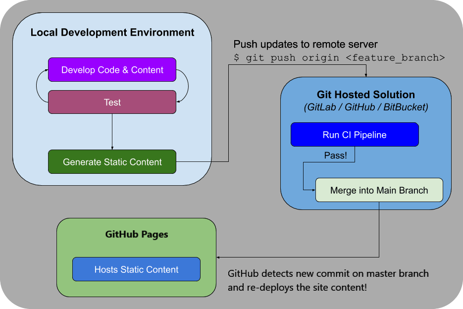

## Overview
This Flask application displays Dr. Jessica De Silva's personal website using a [JAMstack](https://jamstack.org/) architecture. [Frozen-Flask](https://pythonhosted.org/Frozen-Flask/) is used to generate static files based on the Flask application's routes. After that, the static files are hosted on [GitHub Pages](https://pages.github.com/). [HTML5 UP](https://html5up.net/) created the original website design. 

## Website
[https://jessicadesilva.github.io/](https://jessicadesilva.github.io/)

## Installation instructions
Clone the source code from this GitHub repository
```sh
git clone https://github.com/jessicadesilva/jessicadesilva.github.io.git
```
Create a virtual environment and install the required packages
```sh
cd jessicadesilva.github.io
python3 -m venv venv
```
Activate the virtual environment
```sh
source venv/bin/activate
```
Install the Python pakages in requirements.txt
```sh
pip install -r requirements.txt
```

## Run the Development Server
Run development server to serve the Flask application
```sh
python3 app.py
```
Navigate to `http://127.0.0.1:5000/` in your browser to view the website!

## Adding a new page
1. Copy the `website/templates/starter_page.j2` file to the appropriate directory. For example, if you want to add a new research page, copy the file to `website/research/templates/`.
   ```sh
   # Copy the starter_page.j2 file to the research/templates directory as new_page.j2
   cp website/templates/starter_page.j2 website/research/templates/new_page.j2
   ```
2. Update the `new_page.j2` file with the appropriate content.
   ```jinja
    
    
    {# Add page title here #}
    New Page
    
    
    {# Add page content here #}
    New Page Content
    
   ```
3. Add a new route to the appropriate `controller.py` file. For example, if you want to add a new research page, add a new route to `website/research/controller.py`.
   ```python
    # Adds the application endpoint research/new_page.html
    # NOTE: Frozen-Flask requires the .html extension to work correctly 
    @research_blueprint.route('/new_page.html')
    def new_page():
        return render_template('new_page.j2')
   ```
4. Run the development server and navigate to the new page in your browser.
   ```sh
   python3 app.py
   ```
   Navigate to `http://127.0.0.1:5000/research/new_page.html` in your browser to view the new page!

### Build the Static Files
Run the build script from the root directory
```sh
python3 build.py
```
The static files will be generated in the `website/build` directory.

## Workflow
The diagram below depicts a typical workflow for creating a static site with Flask and publishing it to GitHub Pages.



## Project Structure
The folder structure for the project is typical for a Flask project.
```
├── website
│   ├── build           # Static files are created here by Frozen-Flask!
│   ├── events          # Blueprint for event pages
│   │   └── templates   # Templates specific to the events blueprint
│   ├── groups          # Blueprint for mentor-group pages
│   │   └── templates   # Templates specific to the goups blueprint
│   ├── research        # Blueprint for research pages
│   │   └── templates   # Templates specific to the research blueprint
│   ├── static
│   │   ├── css         # CSS files for styling the pages
│   │   ├── js          # JS files for more dynamic pages
│   │   └── image       # Images displayed on the website
│   └── templates       # Base templates and top-level templates
└── venv
```
The important directory to note is `website/build`, which contains the static website files generated by the Frozen-Flask package.

## Jinja Templates
Flask includes the [Jinja](https://flask.palletsprojects.com/en/2.2.x/templating/) templating engine, which is used to generate HTML files.

Variables and/or expressions in a template file are replaced with values when the template is rendered.


Template inheritance allows template files to inherit templates from other files. You can create a base template that defines the website's layout. Because child templates will use this layout, they can concentrate solely on the content.

This project's base template is found at `website/templates/layout/base.j2`.


## Built with
- [](https://pypi.org/project/Flask/2.3.3/)
- [](https://pypi.org/project/Frozen-Flask/)
- [](https://pypi.org/project/flake8/)
- [](https://html5up.net/editorial)